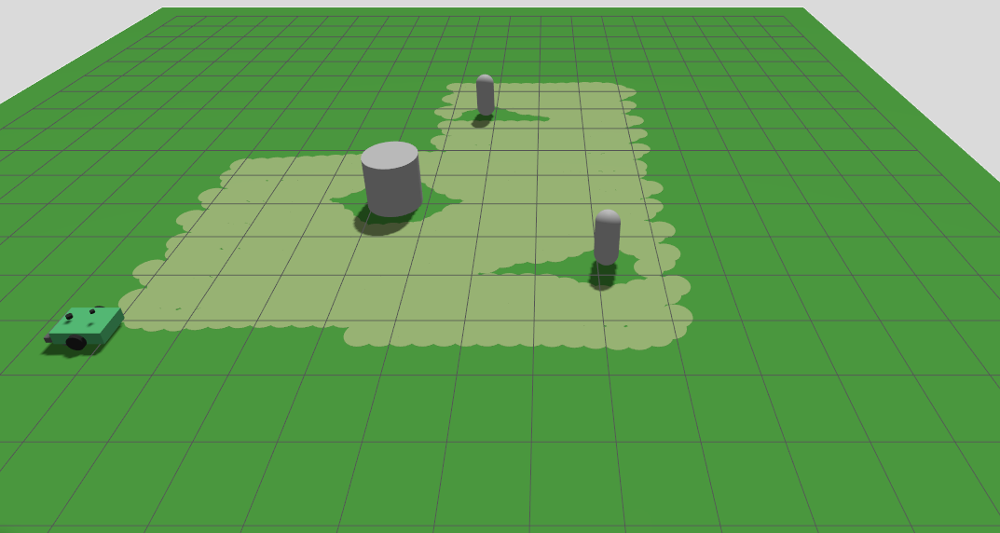

# Robotic Lawn Mower — Version 4

A ROS 2 + Gazebo simulation of a differential-drive robotic lawn mower: a chassis on two driven wheels and a rear caster, with a spinning cutting blade mounted under a mower deck, wheel odometry and simulated GPS/IMU fused through a dual EKF into a persistent `map` frame, a lidar for perception, a Nav2 stack for autonomous navigation and obstacle avoidance, and a GPS-anchored coverage planner that mows the entire lawn boundary autonomously, routing around obstacles it meets on the way and rejoining its mowing pattern behind them. Driving it over the lawn with the blade spinning paints a "mowed" trail on the ground.

The default setup mows the L-shaped boundary in `config/boundary.yaml` — a 10 × 10 m square with its north-east 4 × 4 m quadrant notched out, 84 m² with one reflex corner — on a 22 × 22 m field. The field is deliberately larger than the mow area so an imperfect stop at a boundary corner lands on solid ground instead of driving off the edge.



## What's new in this version

Version 3 got the mower covering a whole lawn: a GPS-surveyed boundary, a boustrophedon sweep across it, and Nav2 driving that sweep from end to end. But the sweep was planned once, before the run, from the boundary polygon alone, and then followed blind — anything standing on a row stopped the mow there and the run was over. Version 4 makes a run react to what it actually finds on the lawn:

| | Version 3 | Version 4 |
|---|---|---|
| Obstacles met during a mow | Followed blind. The controller stops at whatever is in the way, `FollowPath` aborts, and the run ends there with the rest of the lawn uncut | The sweep still ahead of the mower is checked against the global costmap, and rerouted around anything standing on it — the mower rejoins the sweep behind the obstacle and carries on |
| Coverage execution | One `FollowPath` goal for the entire run, on the belief that `controller_server` segfaults on a second goal | Goals are re-issued freely; each detour preempts the one before it. That limit turned out not to exist — see below |
| When the controller gives up anyway | Nothing. A stopped run stayed stopped | Backs up and replans from there; abandons a stretch after repeated failures in one place; stops and says the mower is *stuck* rather than *blocked* when even that buys no progress |
| Costmap use | Written by Nav2, read only by Nav2 | The global costmap is also an input to coverage execution, which needs it published in full and marked further out than Nav2's defaults provide |
| Visibility | Coverage percentage after the fact, from `coverage_checker.py` | Plus `/active_path` and `/coverage_skipped` live in RViz, and an end-of-run summary of detours, recoveries, and metres given up |
| Default mow area | 20 × 20 m square (400 m², ~1030 m of sweep) | L-shaped: 10 × 10 m with the north-east 4 × 4 m quadrant notched out (84 m², one reflex corner, ~193 m of sweep) |

- **Obstacle-aware replanning added.** `coverage_executor.py` grew from a fire-and-forget goal into a supervised one. At `supervision_rate` it projects the mower onto the sweep, tests the next `check_horizon` metres of it against the global costmap, and on a blockage picks the first point past the obstacle where the sweep stays clear for `clear_run` metres, then mows the row up to the obstacle before detouring around to that point and carrying on. Only the stretch the obstacle physically occupies is given up. See [Replanning around obstacles](#replanning-around-obstacles).
- **The "one `FollowPath` goal per process" limit does not exist.** Version 3's executor was built around it, and it is the reason a blocked run had to stop rather than route around. Re-tested directly against `controller_server` with this repo's own `nav2_params.yaml` — four sequential goals sent from result callbacks, then ten preemptions 1.5 s apart — it survived all of them. Whatever the original crash was, it was not that.
- **Three Nav2 settings exist for the replanner's benefit**, all on the global costmap. `always_send_full_costmap: true`, because the default publishes the full grid once — before anything has subscribed — and only incremental patches afterwards, so a node starting with the coverage run has nothing to apply them to. `obstacle_max_range: 6.0` / `raytrace_max_range: 8.0`, because Nav2's 2.5 m default marks obstacles barely outside the footprint, leaving no room to route around them. And a tighter `inflation_radius: 0.40` / `cost_scaling_factor: 5.0`, because the default inflation gave detours a reason to swing right around it — see [How wide the detour swings](#how-wide-the-detour-swings).
- **Obstacles can be put on the lawn without editing the world.** `scripts/spawn_obstacles.py` and `launch/obstacles.launch.xml` spawn cylinders into the running Gazebo world at given positions, optionally after a delay so they turn up part-way through a mow — which is the case the replanner exists for, and not one a static `lawn_field.sdf` can produce.
- **The default boundary is now non-convex.** An L-shape with a reflex corner, so a sweep row can cross it in two disjoint segments and the inset can pinch. `coverage_planner.py` is unchanged from Version 3 — its row clipping already handled this — but the default configuration now exercises it instead of a rectangle that never could.

Everything else is byte-identical to Version 3: the robot model, both EKFs and `navsat_transform`, the Gazebo bridge, wheel odometry, the grass-trail painter, the Nav2 bring-up, `boundary_loader.py`, `coverage_planner.py`, and both diagnostic nodes. The world SDF differs by one line — `real_time_factor` is 2.0 rather than 1.0, so a 193 m sweep runs in about half the wall-clock time when the machine can keep up.

Camera-based obstacle detection/classification is the next milestone; see the [Project guide](#project-guide).

## Packages

- **`mower4_description`** — the robot model.
  - `urdf/robot_base.xacro` — chassis, wheels, caster, deck, blade, bumper, lidar/IMU/GPS mounts (links, joints, inertials).
  - `urdf/common_properties.xacro` — shared materials and inertia macros.
  - `urdf/robot_base_gazebo.xacro` — Gazebo plugins: differential drive, blade joint control, joint state publishing, caster friction, and the lidar (`gpu_lidar`, 5 Hz), IMU (50 Hz), and NavSat (GPS, 5 Hz) sensors.
  - `urdf/robot.urdf.xacro` — top-level file that combines the above into the full robot description.
  - `launch/display.launch.xml` — view the robot in RViz only (no simulation).
  - `rviz/urdf_config.rviz` — RViz display configuration.

- **`mower4_bringup`** — simulation, localization, and navigation bring-up.
  - `worlds/lawn_field.sdf` — a 22 × 22 m grass field, anchored to a real-world lat/lon origin (`spherical_coordinates`, default 45.0 N / 9.0 E) for GPS simulation, with the default Gazebo GUI layout and a video-recorder toolbar button. Loads three sensor system plugins: `Sensors` (rendering sensors — lidar), `Imu`, and `NavSat`. All three are required; `Sensors` alone drives only the lidar, and without the other two the IMU and GPS advertise their topics but never publish.
  - `launch/mower.launch.xml` — launches Gazebo, spawns the robot, and starts `robot_state_publisher`, the ROS↔Gazebo bridge, the grass-cutting trail node, wheel odometry, the local + global EKFs, `navsat_transform_node`, and RViz.
  - `launch/navigation.launch.xml` — starts the Nav2 stack (controller, planner, behavior server, BT navigator, lifecycle manager), operating in the `map` frame.
  - `launch/coverage.launch.xml` — starts the coverage-planning pipeline: `mower4_coverage`'s boundary loader, coverage planner, and coverage executor nodes.
  - `launch/obstacles.launch.xml` — spawns obstacles into the running world so a coverage run has something to route around.
  - `config/gazebo_bridge.yaml` — topic bridge between ROS 2 and Gazebo: clock, `/cmd_vel`, `/joint_states`, `/scan` (lidar), `/imu`, `/gps/fix`, blade command, and ground-truth pose (used to validate odometry drift, not as a navigation input).
  - `config/ekf_local.yaml` — local `robot_localization` EKF (`odom` frame), fusing wheel odometry and IMU yaw.
  - `config/ekf_global.yaml` — global `robot_localization` EKF (`map` frame), additionally fusing GPS-derived odometry.
  - `config/navsat_transform.yaml` — `navsat_transform_node` parameters, including the fixed datum shared with `boundary.yaml` and the world SDF.
  - `config/boundary.yaml` — the mow boundary as GPS lat/lon corners around that same datum: an L-shaped 10 × 10 m area with the north-east 4 × 4 m quadrant notched out, so the coverage planner is exercised on a non-convex polygon rather than a rectangle.
  - `config/nav2_params.yaml` — Nav2 controller/planner/costmap parameters. The global costmap is non-rolling and field-sized (30 × 30 m at origin −15, −15) so it contains the whole boundary plus margin, and is the map the replanner reads and routes detours around — see [Replanning around obstacles](#replanning-around-obstacles) for the two settings that exist for its benefit.
  - `scripts/wheel_odometry.py` — computes odometry from wheel joint states and publishes `/odom`. Integrates on every `/joint_states` sample but publishes at a capped `publish_rate` (default 50 Hz), with the twist averaged over the publish window — `/joint_states` arrives in the hundreds of Hz, which is both wasteful and noisy for the EKF.
  - `scripts/spawn_obstacles.py` — spawns cylindrical obstacles into the running Gazebo world at given `x,y[,radius[,height]]` positions, optionally after a delay so they turn up part-way through a mow. Kept out of `lawn_field.sdf` deliberately: the default field stays clear, and an obstacle that appears mid-run is the case the replanner exists for.
  - `scripts/grass_mower.py` — paints a mowed trail behind the deck while the blade is spinning, using the robot's ground-truth simulated pose (not odometry, which drifts). Paints one `patch_radius` (0.24 m) disc every `trail_spacing` (0.25 m) of travel, accumulated and spawned `batch_size` at a time (default 25) as a single Gazebo model holding many visuals, via a non-blocking subprocess. Both the batching and the spacing exist to bound rendering cost — see [Troubleshooting](#troubleshooting) on the trail slowing the simulation down.

- **`mower4_coverage`** — GPS-anchored coverage path planning and execution, launched by `mower4_bringup`'s `coverage.launch.xml`.
  - `boundary_loader.py` — converts `mower4_bringup`'s `config/boundary.yaml` lat/lon corners into a `map`-frame polygon (`/mow_boundary`).
  - `coverage_planner.py` — insets the boundary by `boundary_inset`, sweeps it into a serpentine coverage path, and resamples it at `point_spacing` before publishing `/coverage_path`.
  - `coverage_executor.py` — drives the sweep and replans around obstacles: it asks the global planner for an approach path to the coverage start, follows that plus the sweep as one `FollowPath` goal, and whenever the costmap shows the sweep ahead blocked it reroutes to the first clear point past the obstacle and carries on. Publishes what it is currently following on `/active_path` and what it had to give up on `/coverage_skipped`.
  - `coverage_checker.py` — (diagnostic) reconstructs the mowed area from ground truth and reports what percentage of the boundary was actually cut, publishing uncovered gaps to `/coverage_gaps` for RViz.
  - `path_tracking_monitor.py` — (diagnostic) compares the planned path, the EKF pose Nav2 steers by, and Gazebo ground truth, to tell controller-tracking problems apart from localization problems.

## Prerequisites

- ROS 2 Jazzy
- Gazebo Harmonic (`gz-sim8`) and `ros_gz`
- `robot_localization` and `Navigation2`, if not already installed:
  ```
  sudo apt install ros-jazzy-robot-localization ros-jazzy-navigation2 ros-jazzy-nav2-bringup
  ```
- `shapely` and `pymap3d`, used by the coverage-planning scripts. Install them for the **system** Python that ROS uses, not a virtualenv:
  ```
  sudo apt install python3-shapely
  pip install --break-system-packages pymap3d
  ```
- (optional, for manual driving) `teleop_twist_keyboard`

> **Do not run any of this with a conda environment active.** ROS 2 Jazzy's `rclpy` ships a C extension built for the system CPython (3.12); conda's interpreter is a different version, so every node dies with `No module named 'rclpy._rclpy_pybind11'`. Run `conda deactivate` before sourcing ROS. If conda auto-activates in new shells, `conda config --set auto_activate_base false`.

## Build

```
colcon build
source install/setup.bash
```

## Running the simulation

**Terminal 1 — launch the robot in Gazebo + RViz** (also starts odometry, GPS/IMU simulation, and local + global localization):
```
ros2 launch mower4_bringup mower.launch.xml
```
**Terminal 2 — spin up the blade** (send `0.0` to stop it):
```
ros2 topic pub --once /blade_cmd_vel std_msgs/msg/Float64 "{data: 30.0}"
```

Drive around with the blade spinning and a lighter-green mowed trail will appear behind the mower deck, matching the robot's actual path.

## Running autonomous navigation

With the simulation already running (Terminal 1 above):

**Terminal 2 — start the Nav2 stack** (now operating in the `map` frame):
```
ros2 launch mower4_bringup navigation.launch.xml
```
## Running full-lawn coverage

With the simulation and Nav2 already running (Terminals 1–2 above):

**Terminal 3 — start the coverage pipeline:**
```
ros2 launch mower4_bringup coverage.launch.xml
```
This loads `config/boundary.yaml` (the mow area boundary in GPS coordinates), insets it, sweeps it into a serpentine coverage path at the mower's cutting width, and drives it end-to-end via Nav2's `FollowPath` action. Watch `/coverage_path` in RViz, and the grass-mower trail should fill in the boundary as it completes.

Spin up the blade first (see above) if you want the trail to actually paint while it mows.

With the defaults (`cutting_width` 0.42, `overlap` 0.15) the row spacing is ~0.357 m, giving 25 rows across the inset boundary — about 193 m of driving, or roughly 11 minutes of sim time at `desired_linear_vel` 0.3 m/s, before any detours.

### Coverage parameters

Set in `launch/coverage.launch.xml`:

| Parameter | Default | Purpose |
|---|---|---|
| `cutting_width` | 0.42 | Deck cutting width; with `overlap` sets row spacing |
| `overlap` | 0.15 | Fractional overlap between adjacent rows |
| `boundary_inset` | 0.5 | Shrinks the boundary before planning, so the robot's body stays inside the mow area |
| `point_spacing` | 0.2 | Resampling resolution of the published path |

`boundary_inset` trades coverage against margin. Rows are planned at least this far inside the boundary, which keeps the robot's body (footprint half-extents 0.35 m fore/aft, 0.25 m lateral) from overhanging it. But the painted swath only reaches `patch_radius` (0.24 m) either side of the path, so any inset larger than that leaves an uncut ring of `inset − 0.24` m around the perimeter — ~0.26 m at the default, cutting ~93% of the boundary. Reduce it to cut closer to the edge, at the cost of the mower overhanging the boundary on turns.

`point_spacing` is not cosmetic. Nav2's controller clips the path it follows to the local costmap window, so a path with only the two endpoints per row (up to 9 m apart) leaves it with a lookahead point on top of the robot and no heading to pursue — it stops dead at the row start. Keep this at planner resolution.

## Replanning around obstacles

The sweep is planned once, before the run, from the boundary polygon alone. It knows nothing about the bush that grew into the lawn or the chair someone left on it, so a coverage run meets obstacles the plan does not contain. `coverage_executor.py` handles them while the run is in progress:

1. It tracks where the mower is along the sweep, and checks the next `check_horizon` metres of it against the **global costmap** — the same map the global planner routes against, so what the executor calls blocked and what the planner will steer around are the same thing.
2. When a stretch comes up blocked, it finds the first point past the obstacle where the sweep stays clear for `clear_run` metres, and asks the global planner for a route to it.
3. That route is planned **from the last clear point before the obstacle, not from where the mower is standing**. The obstacle is spotted `check_horizon` metres out, and the row between here and there is perfectly good grass — so the mower keeps mowing up to the obstacle, and only then detours. The goal it follows is *row up to the obstacle → detour around → rest of the sweep from the rejoin point*, so the only thing given up is the stretch the obstacle physically occupies.
4. If the controller gives up anyway (`FAILED_TO_MAKE_PROGRESS`, `NO_VALID_CONTROL`), it backs up `backup_distance` and replans from where it stands — no lead-in this time, since it has already stopped. After `max_recoveries` attempts in the same place it abandons `stuck_skip` metres of sweep and rejoins beyond it, and if that too buys no progress it stops and says the mower is stuck rather than blocked.

The detour is sent as a new `FollowPath` goal that preempts the running one, which nav2 handles without stopping the mower. The abandoned stretches are published as red outlines on `/coverage_skipped`, and whatever is being followed right now on `/active_path` — add both in RViz. At the end of a run the node prints how many detours it made and how much sweep it gave up. This is a full 193 m run over the default boundary with a single 0.7 m cylinder standing on it, which the sweep crosses on three rows:

```
coverage path complete: 3 detour(s) around obstacles the costmap saw coming, 3 recovery/recoveries after the controller gave up, 3.3m of 193m skipped in 3 stretch(es)
```

About 1.1 m of sweep per row the obstacle stands on — a 0.7 m cylinder plus the clearance either side of it, which is roughly the floor for an obstacle that size.

### Seeing it work

With a coverage run going (Terminals 1–3 above), drop something in front of the mower:

```
ros2 launch mower4_bringup obstacles.launch.xml
```

Each entry in `obstacles` is `x,y[,radius[,height]]`, semicolon-separated, and `spawn_delay` holds them back so they turn up part-way through a mow rather than before it starts:

```
ros2 launch mower4_bringup obstacles.launch.xml \
  obstacles:="0.5,1.5,0.45; -2.0,4.32,0.4" spawn_delay:=60.0
```

Put them somewhere the mower has not reached yet. Spawning a 0.9 m cylinder on top of the robot puts it inside its own footprint, where no plan starts and no control is valid — the executor will report that it is stuck, which is the honest answer.

`coverage_checker.py` still measures against the whole boundary, so a run with obstacles in it will report less than 100% coverage by roughly the obstacles' footprints plus the clearance the mower needs around them. That is real uncut grass, not a reporting artefact.

### Replanning parameters

Set in `launch/coverage.launch.xml`:

| Parameter | Default | Purpose |
|---|---|---|
| `check_horizon` | 3.0 | How far ahead of the mower the sweep is checked against the costmap |
| `obstacle_clearance` | 0.40 | How far a sweep point must be from a real obstacle cell to count as drivable |
| `clear_run` | 0.5 | How far the sweep must stay clear past an obstacle before the mower will rejoin it there |
| `replan_cooldown` | 2.0 | Minimum seconds between replans |
| `stuck_skip` | 2.0 | Sweep given up after repeated failures in one place |
| `max_recoveries` | 3 | Failures in one place before that stretch is abandoned |

`obstacle_clearance` is the one worth understanding, and it sets **how much of a row** is given up. The mower's footprint is 0.25 m half-width, so 0.40 m is that plus 0.15 m for tracking error. Lower it to mow closer in, at the price of the controller refusing rows it judges uncrossable and the executor recovering instead of routing around cleanly.

It is measured in metres against cells that hold a real obstacle, **not** against the inflation gradient. That matters: the gradient's reach is set by `inflation_radius` and `cost_scaling_factor`, so a threshold expressed in costmap units would silently change how much sweep the mower gives up every time the costmap was retuned for a different reason.

"A real obstacle" means `lethal_cost` 254, nav2's `LETHAL_OBSTACLE` — a cell something is actually in. It is worth being deliberate about, because 253 looks like the same thing and is not: `INSCRIBED_INFLATED_OBSTACLE` is painted by the inflation layer over everything within the robot's 0.25 m inscribed radius of a real obstacle. Measuring clearance from those cells adds that 0.25 m to it, and the mower turns a quarter-metre early for no reason anyone can see in the parameters. Measured on a live costmap around a 0.50 m cylinder, cost-254 cells reached 0.12 m past its true surface while cost-253 cells reached 0.35 m.

Expect roughly `obstacle_clearance` + 0.1 m in practice — the costmap is a 0.1 m grid and lidar returns land on cell corners, so marking rounds outwards.

`check_horizon` must stay inside the global costmap's `obstacle_max_range` (6.0 m in `nav2_params.yaml`, raised from nav2's 2.5 m default for exactly this reason) or obstacles only get marked once the mower is on top of them, leaving nothing to route around.

### How wide the detour swings

`obstacle_clearance` decides where the mower stops on the row; it does not decide the shape of the arc that gets it round to the other side. That is NavFn planning on the global costmap's **inflation layer**, and it is worth knowing where the width comes from:

| | |
|---|---|
| Obstacle radius (default test cylinder) | 0.35 m |
| + mower footprint half-width | 0.25 m |
| = physical floor, centre to centre | **0.60 m** |

Cost is zero beyond `inflation_radius` and non-trivial inside it — with nav2's default 3.0 scaling, cells at the very edge of a 0.55 m inflation still cost ~100 against 0 for open grass. So NavFn had every reason to stay outside the whole 0.55 m band and none to come back in, putting the arc 0.90 m from the obstacle's centre. The global costmap therefore runs a tighter, steeper inflation than the local one (`inflation_radius: 0.40`, `cost_scaling_factor: 5.0`), which stays above the 0.25 m inscribed radius the controller's own footprint check depends on. Measured over identical runs:

Measured over identical runs against a 0.35 m test cylinder, this is what the inflation change bought — these figures are the **detour arc**, the closest the mower comes to the obstacle at any point in the manoeuvre:

| | Before | After |
|---|---|---|
| Closest approach to obstacle centre | 0.88 m | **0.72 m** |
| Clear of the obstacle's surface | 0.53 m | 0.37 m |
| Ground-truth samples within 1 m of it | 56 | **183** |
| Recoveries in the same window | 2 | 3 |

0.72 m against a 0.60 m floor. The local costmap is deliberately left at 0.55 / 3.0 — it feeds the controller's collision checking, which keys off the inscribed marking rather than the gradient.

Note which knob does what: this one sets the **arc**, and it is the closest approach because the arc passes nearer than the row ends do. Where the mower stops on the row and turns is `obstacle_clearance` above — on the same runs it turned 0.41–0.48 m from the cylinder's surface, mean 0.45 m, against the 0.40 m configured.

Three settings in `config/nav2_params.yaml` exist for the replanner:

- **`always_send_full_costmap: true`** on the global costmap. With the default `false`, nav2 publishes the full grid once — before anything has subscribed — and only incremental updates after that, so a node starting with the coverage run receives patches with no base grid to apply them to and sees an empty field forever. The executor applies `costmap_raw_updates` too, so it works either way, but it needs one full grid to start from.
- **`obstacle_max_range: 6.0` / `raytrace_max_range: 8.0`** on the global costmap's obstacle layer, as above.
- **`inflation_radius: 0.40` / `cost_scaling_factor: 5.0`** on the global costmap's inflation layer, so detours hug obstacles instead of swinging around the full inflation band.

## Verifying it works

Two diagnostic nodes are included. Run either alongside a coverage run and Ctrl-C to print a summary.

**Did it actually mow everything?**
```
ros2 run mower4_coverage coverage_checker.py
```
Reconstructs the mowed area from ground truth, intersects it with the boundary, and reports a coverage percentage plus a pass/fail against `coverage_threshold` (default 0.95). Uncovered gaps are published as outlines on `/coverage_gaps` — add it as a Marker Array in RViz to see exactly where it missed.

**Is it driving where it thinks it is?**
```
ros2 run mower4_coverage path_tracking_monitor.py
```
Reports cross-track error of both the EKF estimate and ground truth against the planned path, plus the gap between the two. A healthy run looks like this:

```
ground truth vs planned path: mean 0.014m  p95 0.064m  max 0.175m
EKF estimate vs planned path: mean 0.013m  p95 0.067m  max 0.175m
EKF estimate vs ground truth: mean 0.006m  p95 0.011m  max 0.013m
```

If the EKF hugs the path but ground truth does not, localization is lying to Nav2. If both agree yet stray from the path, it's controller tracking. The node prints which of the two it sees.

## Recording a video

The Gazebo window includes a record button in the toolbar (added via `worlds/lawn_field.sdf`) that saves an `.mp4` of the 3D view — click it to start, click again to stop and save.

## Viewing the robot model only (no simulation)

```
ros2 launch mower4_description display.launch.xml
```

## Troubleshooting

Failure modes that cost real debugging time here, and what they look like.

**Nodes die with `No module named 'rclpy._rclpy_pybind11'`** — a conda environment is active. See [Prerequisites](#prerequisites).

**The robot never moves, or Nav2 aborts with `FAILED_TO_MAKE_PROGRESS` (105) / `INVALID_PATH` (103)** — usually the path handed to `FollowPath`, not the controller. The path must be dense (see `point_spacing` above) and its start must be reachable from the robot's current pose. `INVALID_PATH` specifically means the controller found no path poses inside its local costmap, which also happens when the estimated pose is wildly wrong (see the datum note below).

**The GPS-fused pose jumps by ~10,000,000 m** — the datum is on the equator. UTM uses a 10,000 km false northing in the southern hemisphere, so a field straddling latitude 0 makes the northing jump by that amount every time the robot crosses it. Keep the datum at a mid-latitude, away from UTM zone boundaries (zones are 6° of longitude wide). The default 45.0 N / 9.0 E sits in the middle of zone 32N.

**The mowed trail wanders even though Nav2 logs look clean** — Nav2 is tracking its estimated pose perfectly while that pose drifts from reality. Check that each localization input is actually publishing (`ros2 topic hz` takes one topic at a time):
```
ros2 topic hz /gps/fix          # expect ~5 Hz
ros2 topic hz /imu              # expect ~50 Hz
ros2 topic hz /odometry/gps     # expect ~5 Hz
```
Silence here means the global EKF is dead-reckoning on wheel odometry alone, which drifts without bound. The usual cause is a missing `Imu`/`NavSat` system plugin in the world SDF — the sensors advertise their topics either way, so the topics exist but carry nothing. `path_tracking_monitor.py` diagnoses this directly.

**The datum must match in three places** — `worlds/lawn_field.sdf` (`spherical_coordinates`), `config/boundary.yaml` (`datum`), and `config/navsat_transform.yaml` (`datum`). If you move it, recompute the `boundary.yaml` corners for the new origin; the longitude-to-metres scaling changes with latitude.

**`libEGL ... failed to create dri2 screen` from Gazebo** — hardware-accelerated rendering is unavailable and Gazebo has fallen back to software rendering. The simulation still runs, but the real-time factor suffers and control quality degrades with it. This is environment/driver configuration, not a repo setting, and it is the single biggest lever on the slowdown below.

**The mower gets progressively slower the longer it mows** — the robot is not being commanded slower; the simulator's clock is falling behind. Check the real-time factor:
```
gz topic -e -t /world/lawn_world/stats -n 1 | grep real_time_factor
```
Three things compound here. The painted trail accumulates permanently, so its geometry grows linearly with distance mowed. The lidar is a `gpu_lidar`, which re-renders the whole scene once per scan, so that growing geometry is paid for repeatedly rather than once. And if EGL has fallen back to software rendering (above), all of it lands on the CPU with no GPU headroom to absorb it. An observed run decayed from ~1.0 to 0.63 over about 40 minutes of sim time.

Three knobs, in order of leverage: fix the EGL fallback; raise `trail_spacing` in `grass_mower.py` (bounded — see below); lower the lidar `update_rate` in `urdf/robot_base_gazebo.xacro` (currently 5 Hz, ample for a slow mower on a static field).

`trail_spacing` cannot be raised freely. The painted band narrows between discs to `2·√(patch_radius² − (trail_spacing/2)²)`, which must stay wider than the planner's row spacing or adjacent rows leave a visible gap. With the defaults that ceiling is **0.32 m**; the current 0.25 m gives a 0.410 m band against 0.357 m row spacing, ~5 cm of margin.

> Changing anything under `urdf/` requires rebuilding `mower4_description`, not just `mower4_bringup` — the top-level xacro pulls its includes from the install tree, so a source-only edit silently has no effect.

## Project guide
```
1. Manual / teleop driving                                    [done]
2. Odometry + localization                                    [done — local + global (GPS/IMU) EKF]
3. Basic autonomous navigation on a known lawn                 [done — Nav2 operating in the map frame]
4. Coverage path planning for mowing the whole area             [done — boustrophedon planner over a GPS boundary]
5. Simple obstacle detection with simulated lidar or depth data [done — lidar]
6. Camera-based obstacle detection/classification
7. Dynamic replanning around obstacles                          [done — the mower routes around what the costmap sees and rejoins the sweep behind it]
```
